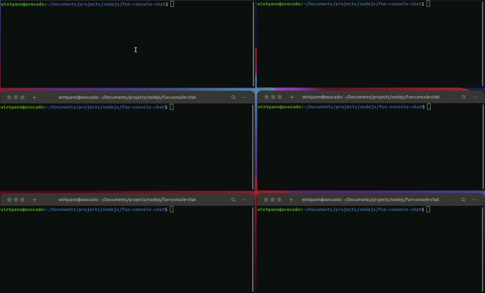

# Nodejs simple console chat

## Requirements

1. Install nodejs
1. Install mongoDB locally or change DATABASE link to some cloud mongoDB (like Atlas)
1. Install dependencies

### First start server
`npm run server`

### Start as many clients as you want
`npm run client`
